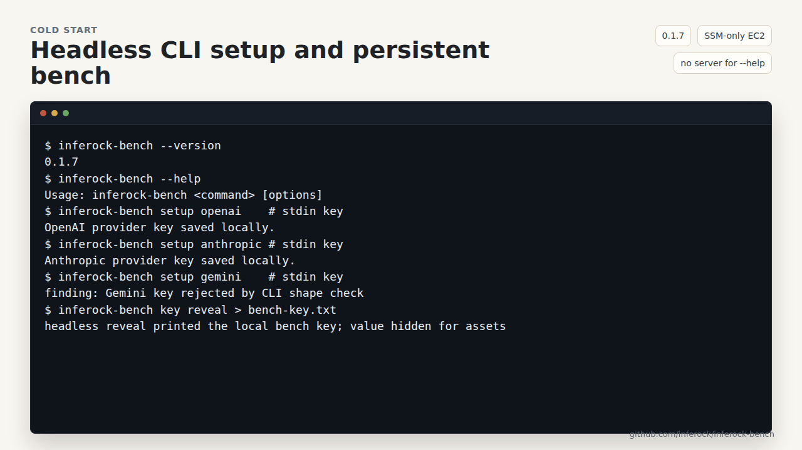
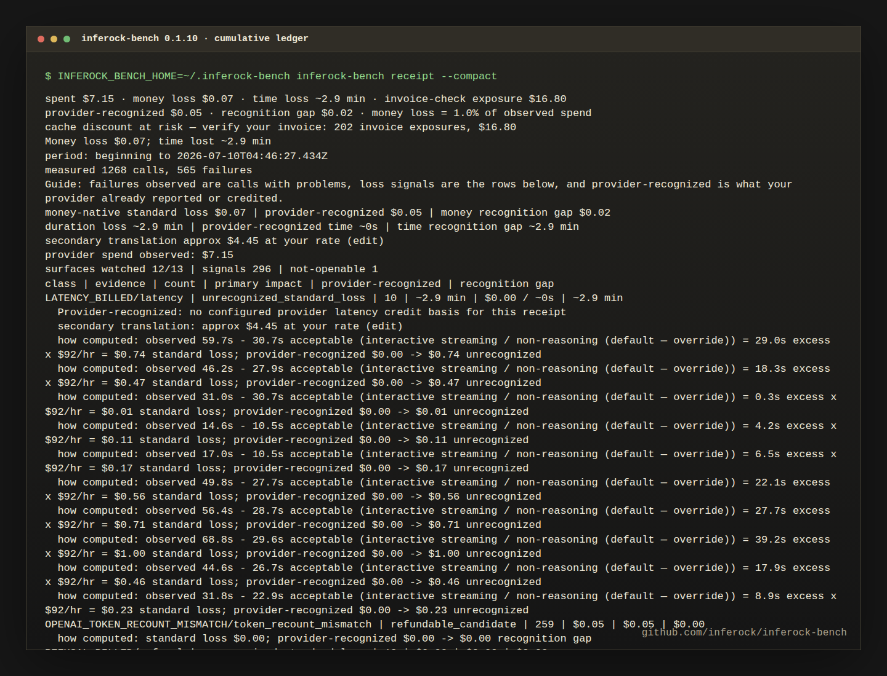
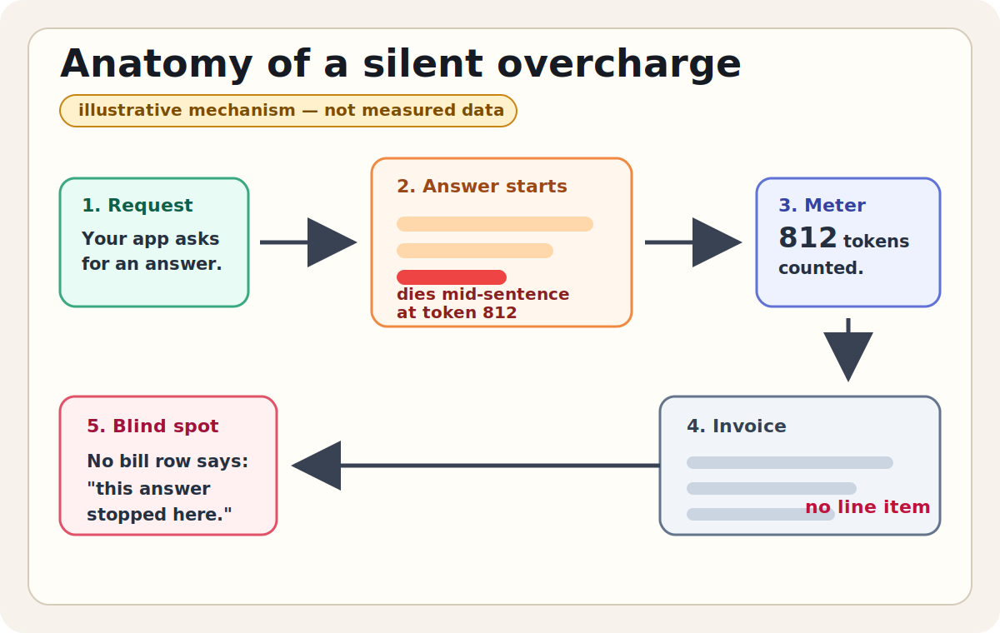
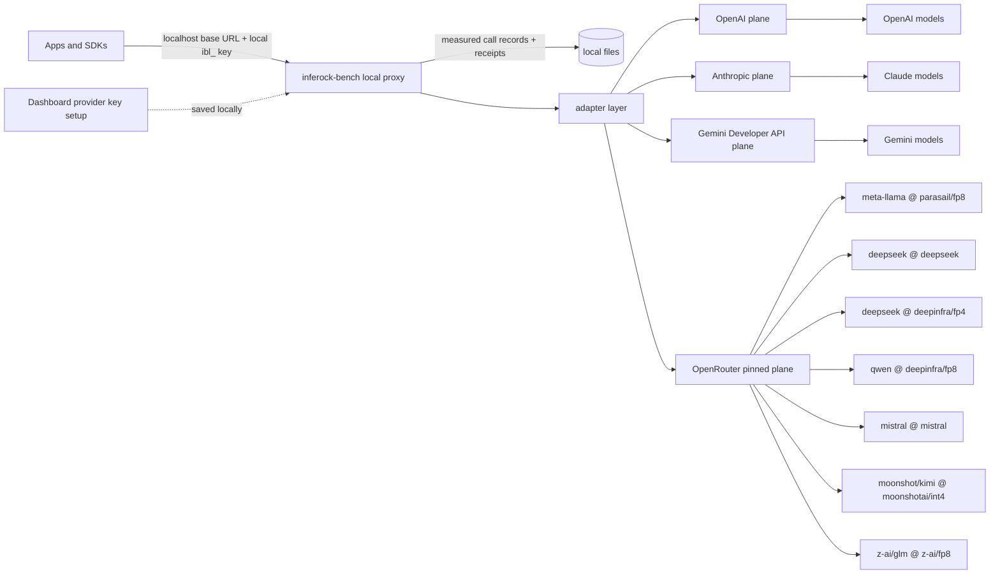

# Your AI bill can be quietly wrong.

<p align="center">
  <a href="https://www.npmjs.com/package/inferock-bench"></a>
  <a href="https://www.npmjs.com/package/@inferock/measure"></a>
  <a href="https://fsl.software"></a>
</p>

<p align="center">
  <strong>Providers shouldn't get to grade their own bills.</strong><br>
  Today, the company that charges you also decides what counts as a failure, what gets credited, and keeps the only detailed records. <code>inferock-bench</code> puts an independent, per-call receipt of what you were billed — and what failed — in your own hands.
</p>

<p align="center">
  We built <code>inferock-bench</code> because we kept paying for answers that died mid-sentence, and nobody could tell us where the money went.
</p>

<p align="center">
  <a href="#quickstart">Quickstart</a> ·
  <a href="#test-your-loss">Test your loss</a> ·
  <a href="#what-your-provider-doesnt-tell-you">What can go wrong</a> ·
  <a href="#how-provider-keys-are-used">Key boundary</a> ·
  <a href="#docs">Docs</a>
</p>


Use it when you need to audit an AI/LLM bill, measure Claude or GPT token usage locally, or answer "was I billed for a failed API call?" It is a local LLM cost-tracking proxy for four measured provider planes: OpenAI, Anthropic, Gemini Developer API, and pinned OpenRouter endpoints spanning meta-llama, deepseek, mistral, moonshot/kimi, z-ai/glm, and qwen on observed hosts. Everything else is extensible-by-design, not measured today. It does not declare every mismatch an OpenAI overcharge or Anthropic billing error; it preserves token, cost, retry, and failure evidence so billing-integrity questions can be checked.

Common cases it can help you inspect: a failed or timed-out request that still has usage, token counts that do not match the visible output, retries that may have amplified cost, and latency or model-version changes that need a trail. It cannot cap provider spend across calls it never sees, and it cannot explain traffic that bypassed the local proxy.

## Why this exists

Your AI bill counts what the model consumed. It has never once counted
whether you got anything for it.

Every other layer of infrastructure has accountability plumbing: SLAs,
uptime pages, invoices you can audit. Model inference has almost none. A
refusal costs the same as an answer. A model can get quietly worse under
the same name. When something goes wrong, the burden of noticing falls
entirely on you.

inferock-bench is a measurement instrument for that gap. It watches real
traffic against real provider APIs and quantifies what mostly goes
unquantified today: reliability, latency, and the money that failure
quietly consumes.

Two kinds of numbers appear in its receipts, and they are labeled as what
they are:

- **Observations** — things that happened: status codes, measured latency,
  provider-reported token counts, detector-flagged calls.
- **Interpretations** — dollar figures computed from observations under
  published assumptions (thresholds, hourly rates, whole-call floors).
  They are our arithmetic applied to real events, not a provider's
  admission.

The project's direction of travel is to move as much as possible from the
second column into the first. The limits that remain are documented, not
hidden: see [MEASUREMENT-PHILOSOPHY.md](./MEASUREMENT-PHILOSOPHY.md).

## The receipt headline

| Receipt word | Plain-English meaning |
| --- | --- |
| `spent` | provider spend observed by the run for priced calls it saw. |
| `money loss` | bill-bounded dollar loss The Inferock Standard can tie to observed spend or charge evidence. |
| `time loss` | real wait or downtime measured as time, never added to dollars. |
| `invoice-check exposure` | an invoice-check amount, such as cache discount at risk; it is labeled "verify your invoice" and never summed into money loss. |

**Real measured traffic, not fixture rows.** Measured since 2026-07-09, the cumulative public ledger through run15 captured 1,268 measured calls, 565 failures/signals, `$7.15` provider spend observed, `$0.07` bill-bounded money loss (stored exact: `$0.073875`), `~2.9 min` time loss, and `$16.80` invoice-check exposure across 202 cache-discount-at-risk signals. The current-code cumulative receipt watches 12 of 13 surfaces and keeps invoice-check exposure separate from money loss.

Run facts: [sanitized public run card for 2026-07-09](./docs/public-run-2026-07-09.md) and [run15 public run card for 2026-07-10](./docs/public-run-2026-07-10.md).

The 2026-07-06 0.1.7 card remains published as a historical artifact; the current public receipt presentation was introduced in 0.1.10 and remains current for this 0.2.1 release candidate.

> [!IMPORTANT]
> The receipt is spend-anchored. The headline is `spent $X · money loss $Y · time loss Z · invoice-check exposure $E`; bill-bounded money loss and recognition gap never include invoice-check exposure. `CACHE_DISCOUNT_AT_RISK` is still visible below the headline as a separate detail line that says "verify your invoice" rather than as money loss or a refund claim.

| Watch it run | Share the receipt |
| --- | --- |
|  |  |

## Quickstart

Run it locally. We think you should be able to see exactly what a provider failure cost you, to the cent. Provider keys are not sent to Inferock; attached only to provider requests.

1. Prerequisite: install Node.js 22+ with npm.

   ```sh
   node --version
   npm --version
   ```

   If either command is missing, install Node.js 22 or newer first.

2. Run the local benchmark:

   ```sh
   npx inferock-bench
   ```

   The first run downloads the package and can take a minute or two before printing anything. Leave it running. You see lines like:

   ```text
   inferock-bench listening at http://127.0.0.1:4318
   Dashboard: http://127.0.0.1:4318/
   Config: ~/.inferock-bench/config
   ```

3. Save your provider key locally.

   Easiest path with the server from step 2 still running: open `http://127.0.0.1:4318/` and save the provider key in the dashboard. Create that key in your provider account first; use a low-limit or development key while evaluating. It stays local under `~/.inferock-bench/`, is saved with owner-only file permissions, and is shown back only in masked form.

   CLI path, before starting the server or after stopping it:

   ```sh
   npx inferock-bench setup <provider>
   ```

   The setup prompt hides your key while you type it. On a headless machine, pipe the key from your secret manager into the same command. To see the current supported provider names, run `npx inferock-bench status` or `npx inferock-bench --help`. A running server does not reload provider keys written by a separate CLI setup process; restart it after CLI setup.

   Any traffic you send through the benchmark is real provider usage. Start with a few short prompts and expect a small evaluation spend, controlled by your provider account limit. The built-in `npx inferock-bench test` flow shows estimated tokens, estimated dollars, and a spend cap before it makes any provider call.

4. Get your local bench key:

   ```sh
   npx inferock-bench key reveal
   ```

   This prints the local `ibl_` bench key to stdout, so it is pipe-friendly. It is a LOCAL-ONLY credential, not your provider key. To copy it to the clipboard instead, run:

   ```sh
   npx inferock-bench key copy
   ```

   If no clipboard is available, the copy command falls back to printing the key. You can also copy the local bench key from the dashboard.

   Check what is configured at any point:

   ```sh
   npx inferock-bench status
   ```

   It shows each provider's configured/masked state, the local store location, server state, and version.
   For a fast command list or package version without starting the server, use `npx inferock-bench --help` or `npx inferock-bench --version`.

5. Point some traffic at the local benchmark.

   No app yet? Use one of these equal local targets after saving the matching provider key in step 3.

   Claude Code:

   ```sh
   npm i -g @anthropic-ai/claude-code
   ANTHROPIC_BASE_URL=http://127.0.0.1:4318 ANTHROPIC_API_KEY=ibl_your_local_bench_key claude -p "Draft a five-bullet checklist for reviewing an AI invoice."
   ```

   OpenAI SDK:

   ```ts
   import OpenAI from "openai";

   const openai = new OpenAI({
     apiKey: process.env.INFEROCK_BENCH_KEY ?? "ibl_your_local_bench_key",
     baseURL: "http://127.0.0.1:4318/v1",
   });

   await openai.chat.completions.create({
     model: "gpt-4o-mini-2024-07-18",
     messages: [{ role: "user", content: "Draft a five-bullet checklist for reviewing an AI invoice." }],
   });
   ```

   Gemini:

   ```ts
   await fetch("http://127.0.0.1:4318/v1beta/models/gemini-2.5-flash:generateContent", {
     method: "POST",
     headers: {
       authorization: "Bearer " + (process.env.INFEROCK_BENCH_KEY ?? "ibl_your_local_bench_key"),
       "content-type": "application/json",
     },
     body: JSON.stringify({
       contents: [{ role: "user", parts: [{ text: "Draft a five-bullet checklist for reviewing an AI invoice." }] }],
     }),
   });
   ```

   For these commands, the SDK API key is the local `ibl_` bench key from step 4. Your provider key is not passed to Claude Code or your app; it is not sent to Inferock and is attached only to provider requests. If you configured OpenRouter, use the provider-specific SDK snippet in the dashboard's Local app connection panel or in the package README.

   Note: a Claude subscription (OAuth) login is not a supported mechanism for measuring calls. `inferock-bench` measures metered API traffic only — save a provider API key in the bench and point your SDK or agent at it with the local `ibl_` key, as shown above.

   After the first successful proxied call, the terminal running `inferock-bench` prints:

   ```text
   first call measured ✓
   ```

6. View your receipt from another terminal:

   ```sh
   npx inferock-bench receipt --compact
   ```

   If you installed `inferock-bench` globally, `inferock-bench receipt --compact` works too. This README uses the `npx inferock-bench <cmd>` form so one-time users are not stranded.

### Already have an app?

Change exactly two SDK settings: `apiKey` and `baseURL`.

```ts
const client = new YourProviderSdk({
  apiKey: process.env.INFEROCK_BENCH_KEY ?? "ibl_your_generated_local_key",
  baseURL: "http://127.0.0.1:4318",
});
```

Some SDKs use `/v1` in the base URL. The dashboard shows the exact value for every configured provider; `npx inferock-bench init` prints OpenAI and Anthropic constructor snippets.

Run `npx inferock-bench init` to detect OpenAI or Anthropic SDK usage and print the exact SDK change. `npx inferock-bench init --patch path/to/client.ts --yes` patches simple constructors only when it can update both `apiKey` and `baseURL`; otherwise it refuses with a clear message. For Gemini or OpenRouter, use the dashboard's Local app connection snippet or the package README's provider example.

<details>
<summary>Run from source</summary>

```sh
git clone https://github.com/inferock/inferock-bench.git
cd inferock-bench
pnpm install
pnpm -r --workspace-concurrency=1 build
node apps/inferock-bench/dist/index.js start
```

</details>

## Test your loss

`npx inferock-bench test` runs the complete coverage battery through your configured provider scope, on your provider key, so the receipt can show what your provider cost you and which loss surfaces the run actually opened. The checked-in measured baseline powers the estimate, so a configured provider key and priced compatible model are enough to reach the consent step.

For the exact formulas behind the receipt, see [Paid-loss arithmetic](./docs/loss-arithmetic.md).

You see the estimated tokens, estimated dollars, model, suite, baseline, pricing source, and spend cap before any provider call is made. The copy states the price plainly: running the complete test set on the selected provider(s) will cost approximately the displayed amount. If you stop there, the command makes zero provider calls. Interactive runs require you to type `RUN`; automation must pass the displayed hash with `--accept-estimate <hash>` because `--yes` alone is not consent to a changed estimate.

In the dashboard, open Advanced options, set Test driver to Agent test, then run the test to use a real coding agent. Agent test currently supports OpenAI and Anthropic runs; use the built-in generator for Gemini and OpenRouter coverage. If the pinned local agent is not installed, the dashboard names the exact npm tarballs, versions, SRI checksums, sizes, source URLs, and local install path before downloading. The agent receives only localhost and an ephemeral local `ibl_` key, never your provider key. CLI equivalent: `npx inferock-bench test --generator agent`.

The receipt is run-scoped. It reports `spent $X · money loss $Y · time loss Z · invoice-check exposure $E`, provider-recognized recovery, bill-bounded recognition gap, the separate invoice-check exposure detail line when applicable, and `surfaces watched N of M surfaces your selected providers can open (M varies by provider)`, with every surface labeled `watched-clean`, `signal`, or `not-openable`. A zero only counts when the surface was watched; unopened surfaces are named as coverage debt, not silently claimed clean. For a priced call that fails the standard and is tied to observed spend or charge evidence, money loss is bill-bounded; provider-recognized can still be `$0`, and the gap is the difference inside that bill-bounded money ledger.

The receipt opens with a one-line plain-English guide to spent dollars, bill-bounded money loss, time loss, and invoice-check exposure. A receipt "failure" is a measurement finding, not necessarily your app crashing. A `signal` is one finding the benchmark saw, such as a token cross-check. `CACHE_DISCOUNT_AT_RISK` is shown as invoice-check exposure with "verify your invoice" guidance; it is not summed into money loss or recognition gap. `Provider-recognized` is the part that appears likely to fit the provider's current credit rules; bill-bounded gaps stay visible instead of being hidden.

If no provider key is configured, pricing is unknown, or the token baseline is ever absent or bootstrap-only, the CLI and dashboard fail closed and make zero provider calls. The baseline-degraded state is reported as ``baseline not measured yet: run `npx inferock-bench test --record-baseline` with explicit consent to produce a real per-task token baseline.`` The method details are in [Coverage test methodology](./docs/coverage-test-methodology.md).

## What your provider doesn't tell you

The gap is simple: providers give you totals. They usually do not give you the per-call receipt you would need to prove which answer broke, which retry ran, or which token count changed.

We do not think you should have to trust a monthly total. We think every broken answer should leave a trail: what happened, how sure we are, and whether the provider would actually recognize the claim.



**Illustrative mechanism — not measured data.** This is the kind of billing blind spot we built `inferock-bench` to catch on your own traffic.

| What can go wrong | Does your provider quantify it for you? | What inferock-bench does |
| --- | --- | --- |
| Answer cut off, still billed | Provider docs should say when partial streams, timeouts, and incomplete answers are billed. The [disclosure annex](./spec/disclosure-annex.md#failed-partial-filtered-and-incomplete-billing) records that main first-party APIs do not fully publish those rules. | Records why the answer ended, what text arrived, how many tokens the provider says it used, and what that should cost. We tell you when it looks strong enough to ask for a credit, and when it is only something to watch. |
| Empty reply, still billed | Providers should separate hidden billed tokens from text you can see, so an empty answer is not misread. The [annex](./spec/disclosure-annex.md#hidden-and-non-visible-token-classes) says customers need that detail to check the bill. | Checks empty visible content against hidden billed-token, tool, safety, and refusal explanations. If billed output has no documented explanation, we mark it as a credit candidate. If the explanation is missing or unclear, we keep it as watch-only proof. |
| More tokens billed than received | A visible recount can be wrong if hidden billed tokens are mixed in. The [annex](./spec/disclosure-annex.md#hidden-and-non-visible-token-classes) names refusal, rejected-prediction, reasoning, thinking, and cache tokens as details customers need. | Recounts visible output while allowing for cases where extra hidden tokens are valid. Overcounts beyond tolerance can become credit candidates when pricing is known. Missing price or token detail stays watch-only. |
| Silent retry, double bill | Providers should give you one operation ID that ties retries together, but the [annex](./spec/disclosure-annex.md#idempotent-inference-apis) records that checked first-party APIs do not consistently offer that on AI calls. It also records retry instructions without per-call charge proof. | Keeps retry evidence visible and now computes Inferock-standard retry loss for non-final provider-fault attempts. Strong evidence uses provider retry headers; weaker evidence uses a body-hash fallback. Provider-recognized recovery still needs charge proof. |
| Outage you paid through | Provider docs should publish billing rules for provider errors and timeouts. The [annex](./spec/disclosure-annex.md#failed-partial-filtered-and-incomplete-billing) records missing main-API billing rules, while [availability rules](./spec/disclosure-annex.md#availability-service-level-objective-parity) vary across cloud partners. | Captures response code, timing, and provider error proof. It becomes a credit candidate only when the failure was caused by the provider, billed, priced, and covered by a published rule. |
| Refused and billed | Providers should put refusal billing rules in the response. The [annex](./spec/disclosure-annex.md#refusal-billing-invariant) records how documented before-output and mid-stream rules can differ. | Separates before-output refusals from mid-stream refusals. A documented no-charge rule plus a real charge row becomes a credit candidate. Everything weaker stays watch-only. |
| Cache you paid full price for | Billing pages should use the same cache categories the response uses. The [annex](./spec/disclosure-annex.md#usage-category-parity) says customers need cache mode, token type, tier, and geography in both places. | Compares cache usage with expected cache pricing. It becomes a credit candidate only with charge proof from the provider; otherwise it stays watch-only. |
| Quality or tier changed and nobody announced it | Providers should disclose which exact model version, service level, and feature settings handled the call. The [annex](./spec/disclosure-annex.md#served-model-and-backend-identity) records missing or partial pieces today. | Records the model version and service level when exposed and keeps the trail. In the first public version, this is watch-only. We do not book refund dollars for quality changes. |

Trust boundary: read [what leaves your machine](./docs/what-leaves-your-machine.md) and [how keys are handled](./docs/key-handling.md) before pasting a provider key.

## How provider keys are used

We designed `inferock-bench` as a local process with a browser dashboard. Your app sends normal development traffic to localhost, `inferock-bench` forwards it to the provider with the provider key, and `@inferock/measure` turns the captured calls into a live dollar-loss receipt. Provider keys are not sent to Inferock; attached only to provider requests. The generated local bench key stays on your machine unless you copy it somewhere else.



Measured today means the four public provider planes above. OpenRouter is measured only for the current pinned endpoint set when requested pinning, served endpoint metadata, and cited pricing evidence match. Additional providers are extensible-by-design until their adapter, pricing, taxonomy, SLA, and coverage gates exist.

## Adding a provider

This is the design contract, not a roadmap promise. A new provider becomes measured support only after all of these exist:

- Adapter: request, response, stream, error, and provider identity mapping into canonical events.
- Cited pricing: source URL, retrieved date, effective date, model or plane, and usage categories; missing or partial rows emit `pricing_unknown`, not `$0`.
- Fault taxonomy: provider errors, finish reasons, refusals, safety/filter fields, retry headers, and terminal stream states mapped without inventing creditability.
- SLA honesty lookup: provider-recognized credit, downtime, or latency rules are explicit; otherwise provider-recognized stays `$0 / 0s`.
- Oracle-or-not-openable coverage: each signal declares whether the provider has the evidence surface needed to judge it; unsupported surfaces stay `not-openable`.

Until those gates exist, a provider is extensible-by-design, not measured support.

This repo is a local diagnostic benchmark, not [hosted Inferock](https://inferock.opiusai.com). Production use that needs secure key custody, routing/failover, recovery, support, invoice reconciliation, provider leverage, or audit workflows belongs in [hosted Inferock](https://inferock.opiusai.com).

## Why this matters

Vaudit reported in June 2026 that it reviewed about $34M of AI invoices, found about $1.7M in overbilling, and saw providers credit roughly 80% of disputes; that refund-rate detail is not independently verified ([Business Wire](https://www.businesswire.com/news/home/20260630108235/en/Vaudit-Launches-TokenAudit-to-Recover-Millions-in-Enterprise-Token-Spend-Billing-Errors-From-Anthropic-OpenAI-and-AI-Providers), [TechStartups/The Information re-report](https://techstartups.com/2026/06/25/anthropic-and-openai-customers-overcharged-by-1-7m-in-billing-errors-startup-audit-finds/)). The asymmetry is the point: the same models can carry credit-backed cloud SLAs while first-party API customers get thinner or no published SLA terms; details belong in the [spec annex](./spec/disclosure-annex.md). Providers deny broad overbilling: Anthropic says it "does not charge customers for incomplete requests or error messages, does not route customer requests to older models, and does not see signs that overbilling is a widespread issue"; OpenAI says "no evidence that those issues are happening among its customers". These provider statements are included as denials and scope boundaries, not as admissions; `inferock-bench` treats them as claims to test against local per-call evidence.

That is why we are staking out [The Inferock Standard](./spec/standard.md). We do not want the provider to be the only party allowed to define loss. A broken answer can cost bill-bounded money, time, or both even when the provider does not recognize it yet. The receipt leads with observed spend, bill-bounded money loss, time loss, and invoice-check exposure; invoice-check exposure is never summed into money loss. So we separate the dollars a provider is likely to credit from the time, bill-bounded money loss, and invoice-check exposure you still need to inspect. Mixing them would make a louder headline and a weaker receipt.

This is an evolving benchmark standard, versioned on purpose: every rule change lands in the [standard changelog](./spec/CHANGELOG.md), and feedback backed by real receipts shapes the next version. If a category is wrong, show us and it gets fixed in public.

The real captures above are from the cumulative measured ledger, not fixture rows: 1,268 measured calls across OpenAI, Anthropic, Gemini, and pinned OpenRouter coverage, `$7.15` provider spend observed, `$0.07` bill-bounded money loss, `~2.9 min` time loss, and `$16.80` cache-discount-at-risk exposure that stays out of headline money loss. Provider-specific surfaces that did not apply stayed labeled rather than claimed clean. If your normal traffic is clean, `inferock-bench` should say so. If it is not, the receipt tells you what happened and how strong the claim is. Every run also reports which measure surfaces the traffic actually exercised: `N of M surfaces your selected providers can open (M varies by provider)`. A zero only counts for a watched surface, and anything unexercised is labeled, never silently claimed clean.

## Share your receipt

Export the receipt when you want a compact, shareable proof card from your own measured traffic:

```sh
npx inferock-bench receipt --compact
```

The receipt leads with spend, bill-bounded money loss, time loss, and invoice-check exposure. Provider-recognized recovery, recognition gap, and cache-discount invoice-check exposure detail render below the headline. It is not a provider ranking and it is not generated from fixtures.

## Docs

| Start here | Use this when |
| --- | --- |
| [The Inferock Standard](./spec/standard.md) | the public rulebook for what counts as loss, what counts as recoverable, and what stays separate. |
| [Hard questions](./docs/hard-questions.md) | direct answers to the launch questions skeptics are most likely to ask. |
| [Public run card: 2026-07-10](./docs/public-run-2026-07-10.md) | run15 facts, cumulative-store reconciliation, and adaptive issue-weighted denominator disclosure. |
| [Public run card: 2026-07-09](./docs/public-run-2026-07-09.md) | sanitized aggregate receipt facts for the first 0.1.10 public real-traffic component. |
| [Historical public run card: 2026-07-06](./docs/public-run-2026-07-06.md) | historical sanitized aggregate receipt facts for the pre-exposure-split public real-traffic run. |
| [What leaves your machine](./docs/what-leaves-your-machine.md) | the exact local/network boundary from the shipped benchmark code. |
| [Key handling](./docs/key-handling.md) | provider keys, the local `ibl_` key, masking, rotation, and malicious-fork risk. |
| [inferock-bench app README](./apps/inferock-bench/README.md) | package-level quickstart and CLI command summary. |

<details>
<summary>Standard and method references</summary>

- [Event schema](./spec/event-schema.md) - the exact call record shape that lets a receipt trace back to real provider traffic.
- [What each signal means](./spec/signals.md) - the public signal list, with the guardrails that stop weak claims from becoming refund claims.
- [What providers should disclose](./spec/disclosure-annex.md) - the gap list: the fields, billing rules, and service commitments customers need.
- [Standard changelog](./spec/CHANGELOG.md) - version history for the public standard package.
- [Standard fixture examples](./spec/examples/README.md) - fixture-data warnings and example-file scope for the spec examples.
- [SLA defaults](./spec/sla-defaults.md) - generated threshold and time-value defaults used by the standard math.
- [Coverage test methodology](./docs/coverage-test-methodology.md) - what `npx inferock-bench test` sends, why it is normal usage, and how receipt coverage states work.
- [Evidence grade methodology](./docs/evidence-grade-methodology.md) - how detector postures become evidence grades without manual maintainer scoring.
- [Pricing methodology](./docs/pricing-methodology.md) - how static price rows, source dates, and `pricing_unknown` handling work.
- [Threat model](./docs/threat-model.md) - what the local benchmark does and does not protect against.
- [Security policy](./SECURITY.md) - how to report vulnerabilities and what support expectations are realistic.
- [Asset provenance](./assets/README.md) - the no-mock policy for screenshots, GIFs, receipt images, and explanatory diagrams.
- [@inferock/measure on npm](https://www.npmjs.com/package/@inferock/measure) - the measurement math library behind the receipt; source ships in [packages/measure](./packages/measure/README.md).
- [CONTRIBUTING](./CONTRIBUTING.md) - how to run checks, change the benchmark, and keep public claims defensible.
- [MAINTAINERS](./MAINTAINERS.md) - public ownership and maintainer expectations for the repo.

</details>

## Founders

Built by Bharath Koneti ([LinkedIn](https://www.linkedin.com/in/bharathkoneti/), [X](https://x.com/bharathakoneti)) and Himashwetha Gowda ([LinkedIn](https://www.linkedin.com/in/himashwethagowda/)), building Inferock at [OpiusAI](https://opiusai.com) — the AI-provider accountability standard.

Run it. Send us your receipt. Argue with our taxonomy. If a category is wrong, tell [Bharath](https://x.com/bharathakoneti) or [Himashwetha](https://www.linkedin.com/in/himashwethagowda/) with examples, so the standard gets sharper instead of louder.

## Reliability Index

Reliability index is pre-launch. You can opt in locally today to preview the anonymized aggregate payload; nothing is sent until the public backend goes live and review/revoke controls are preserved.

```sh
npx inferock-bench index on
```

Rules: opt-in only, no third parties, public aggregates, one-command off, and show the data before first send. Every index number is real measured data only; no seeded or manufactured index stats.

Status: the public index backend is pre-launch. Opting in today records your consent locally and shows you the exact payload; nothing is sent yet. When the public index goes live, opted-in benches will be able to contribute to the scoreboard, and you can review or revoke that opt-in before data leaves your machine.

## FSL Explained

- Free local benchmark use.
- Source-available protection against hosted production substitution.
- Converts to Apache-2.0 after 2 years.

`inferock-bench` uses FSL-1.1-Apache-2.0 with 2-year Apache-2.0 conversion. `@inferock/measure` is Apache-2.0. The Inferock Standard is CC-BY-4.0.
