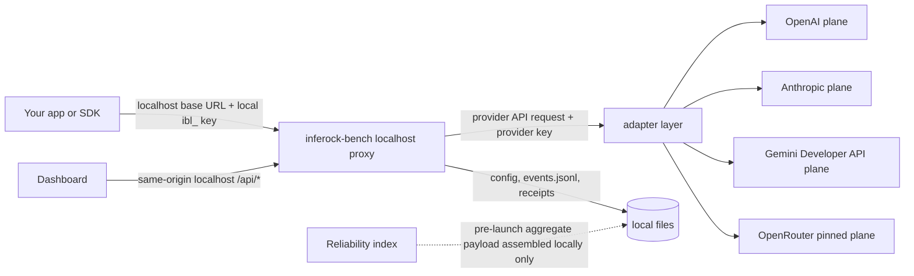

<!--
Maintainer source map: apps/inferock-bench/src/config.ts; apps/inferock-bench/src/provider.ts; apps/inferock-bench/src/proxy.ts; apps/inferock-bench/src/storage.ts; apps/inferock-bench/src/telemetry.ts; apps/inferock-bench/src/cli.ts; apps/inferock-bench/src/server.ts; apps/inferock-bench/src/dashboard.ts; apps/inferock-bench/src/receipt.ts; apps/inferock-bench/src/openrouter-pins.ts; apps/inferock-bench/src/adapters/canonical-v2.ts; apps/inferock-bench/src/adapters/openai.ts; apps/inferock-bench/src/adapters/anthropic.ts; apps/inferock-bench/src/adapters/gemini.ts; apps/inferock-bench/src/adapters/openrouter.ts; packages/measure/src/canonical-event.ts.
Before changing a privacy claim here, verify the code paths above.
-->

# What leaves your machine

Short version: your normal model request still goes to the model provider. Your provider keys and receipts do not go to Inferock. The reliability index is off by default and, in this pre-launch build, does not send anything even after you opt in.

Read this before pasting a provider key or sharing a receipt. The page separates the request path, key path, local files, real-agent path, and reliability-index path so the trust boundary is visible before the implementation details.

| Boundary | Short answer |
| --- | --- |
| Model request | Goes to the selected provider through the local proxy. |
| Provider key | Stays in the local process/config or environment, then attaches only to provider requests. |
| Receipt and events | Stay local until you copy, post, attach, or otherwise share them. |
| Reliability index | Pre-launch and local-only in this build, even after opt-in. |

Illustrative data-flow, not measured data:



## Provider requests

`inferock-bench` runs a local server on `127.0.0.1:4318` by default. Your app sends OpenAI-compatible chat-completions traffic to `/v1/chat/completions`, OpenAI Responses traffic to `/v1/responses`, Anthropic Messages traffic to `/v1/messages`, Gemini GenerateContent traffic to `/v1beta/models/:model:generateContent`, or pinned OpenRouter OpenAI-compatible chat traffic to `/openrouter/v1/chat/completions`.

For OpenAI traffic, the proxy sends the request to the configured OpenAI base URL and defaults to `https://api.openai.com/v1`. For Anthropic traffic, it sends the request to the configured Anthropic base URL and defaults to `https://api.anthropic.com/v1`. For Gemini traffic, it sends the request to the configured Gemini base URL and defaults to `https://generativelanguage.googleapis.com/v1beta`. For OpenRouter traffic, it sends the request to the configured OpenRouter base URL and defaults to `https://openrouter.ai/api/v1`. Those base URLs can be overridden with local environment variables, including `INFEROCK_BENCH_OPENROUTER_BASE_URL` for OpenRouter.

There is no separate Inferock cloud call in the request path. The provider sees the request you asked `inferock-bench` to proxy, because that is how the benchmark measures real traffic.

## Real-agent mode downloads

The dashboard Advanced options path (Test driver -> Agent test) and CLI
`inferock-bench test --generator agent` can auto-provision a local coding
agent. Auto-provisioning is blocked until the UI or CLI shows the exact
packages, versions, npm registry tarball URLs, SRI checksums, sizes, install
path, and reason for the download.

The pinned default is `opencode-ai@1.17.13` plus the matching platform package
such as `opencode-linux-x64@1.17.13` or `opencode-darwin-arm64@1.17.13`. The
primary installer fetches the exact tarballs from `https://registry.npmjs.org/`,
verifies SRI, and unpacks them under:

```text
~/.inferock-bench/agents/opencode-ai/1.17.13/
```

It does not install globally and does not use sudo. It does not run npm
lifecycle scripts in the primary trust path.

If the agent is user-supplied with `--agent-cmd`, `inferock-bench` does not
download an agent and labels the receipt `source=user-supplied`.

## Real-agent network path

For supported OpenAI and Anthropic agent runs, the real agent receives a scratch
workspace, a localhost proxy base URL, and an ephemeral run-scoped `ibl_` key. It
does not receive provider keys in environment variables, command arguments,
config files, stdin, or prompt text. Use the built-in generator for Gemini and
OpenRouter coverage.

The agent's model requests still go through the local proxy. The proxy attaches
the real provider key inside the `inferock-bench` process, forwards the request
to the selected provider, and records the measured event locally. The provider
sees the model request because that is the measured traffic. Inferock does not
receive the request or receipt.

Agent scratch workspaces are under:

```text
~/.inferock-bench/runs/
```

Those workspaces can contain the bundled coding-task files and any changes the
agent makes while running the benchmark.

## Provider keys

Provider keys come from local environment variables or from the local config file. OpenAI keys use `INFEROCK_BENCH_OPENAI_API_KEY` or `OPENAI_API_KEY`. Anthropic keys use `INFEROCK_BENCH_ANTHROPIC_API_KEY` or `ANTHROPIC_API_KEY`. Gemini keys use `INFEROCK_BENCH_GEMINI_API_KEY`, `GEMINI_API_KEY`, or `GOOGLE_API_KEY`. OpenRouter keys use `INFEROCK_BENCH_OPENROUTER_API_KEY` or `OPENROUTER_API_KEY`. The default config path is:

```text
~/.inferock-bench/config
```

You can move that directory with `INFEROCK_BENCH_HOME`.

When `inferock-bench` writes the config file, it writes it with `0600` permissions and then applies `chmod 0600`. The dashboard and API status show provider keys only in masked form. Environment-variable keys are read from your process environment and are not written back to the config file unless you save a key through the dashboard setup flow.

## Local bench key

The `ibl_` key is a local bench key generated by `inferock-bench`. Your app uses it as the API key when it calls localhost. It is not an Inferock cloud credential.

The generated bench key is stored in the same local config file as saved provider keys, with the same `0600` file permissions. You can also override the accepted local key with `INFEROCK_BENCH_KEY`.

Real-agent mode creates an additional ephemeral `ibl_` key scoped to one
provider run. That key is not written to the config file and is revoked when
the run ends.

## Local event log

Measured calls are appended to:

```text
~/.inferock-bench/events.jsonl
```

That file is local. It is the evidence behind the dashboard, report, and receipt.

The event log does not store provider keys. It can store response text, tool calls, tool schemas, model names, finish reasons, provider usage fields, timing, provider request IDs, selected rate-limit/retry headers, and detector evidence. As built, the canonical event does not store the full request prompt/messages, but tool schemas and response content can still be sensitive.

Treat `events.jsonl` as private.

## Dashboard and receipts

The browser dashboard talks to the local `inferock-bench` server with same-origin `/api/*` requests. Receipt JSON files are written locally under:

```text
~/.inferock-bench/receipts/
```

Receipts stay local until you copy, post, attach, or otherwise share them.

## Reliability index

The reliability index is opt-in. If you do nothing, it is off. In a non-interactive run, it defaults to off and prints the command you can use if you want to opt in. Opting in records consent locally so you can review or revoke it.

When enabled, today's code builds this payload locally:

```json
{
  "schemaVersion": "inferock-bench-reliability-index-v1",
  "generatedAt": "ISO timestamp",
  "period": {
    "since": "ISO timestamp or null",
    "until": "ISO timestamp"
  },
  "measuredCalls": 0,
  "failureCounts": [
    {
      "failureClass": "string",
      "evidenceGrade": "string",
      "count": 0
    }
  ]
}
```

It does not include prompts, outputs, provider keys, raw traces, customer identifiers, provider request IDs, or receipts.

The public backend is not live in this build. If the index is off, the sender returns `reliability index is off`. If no endpoint is configured, it returns `index endpoint not yet live; payload assembled locally only`. Even if an endpoint is configured, the sender still returns `index endpoint configured, but sender is disabled until the reliability index is live`.

That means contribution is pre-launch and local-only today. When the public index goes live, opted-in benches will be able to contribute anonymized aggregate counts only after preserving the review and revoke controls described here.

## What to read next

- [Key handling](key-handling.md) for provider keys, local `ibl_` keys, masking, and rotation.
- [Threat model](threat-model.md) for what the local benchmark does and does not protect against.
- [Hard questions](hard-questions.md#q14-can-raw-event-logs-leak-data) before posting any event-derived artifact.
